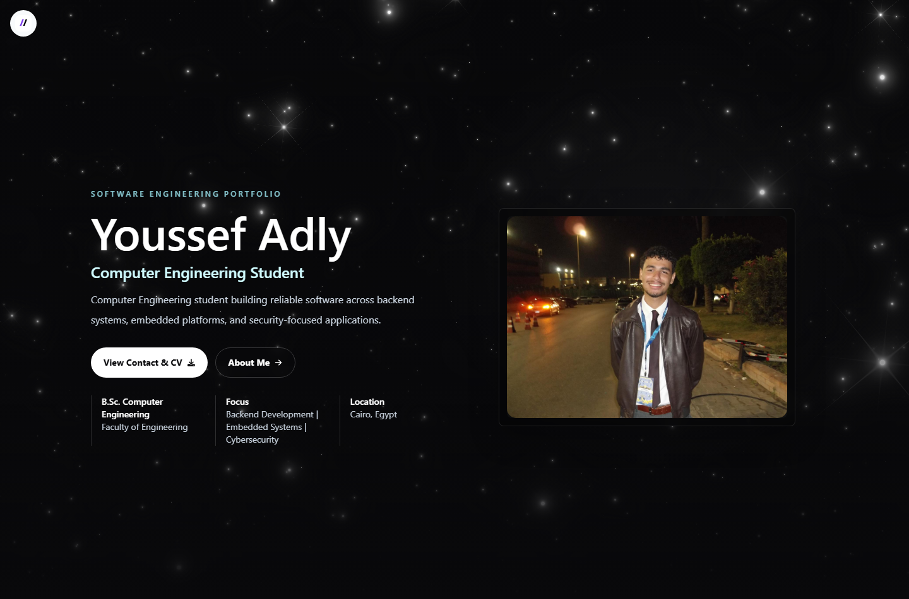

<div align="center">
  

  # Youssef Adly Portfolio

  A modern, interactive computer engineering portfolio built with React, Vite, Tailwind CSS, React Router, and ReactBits-inspired visual components.

  <p>
    <a href="https://github.com/YoussefAdly14">GitHub</a>
    &middot;
    <a href="https://www.linkedin.com/in/youssef-adly-755261314">LinkedIn</a>
    &middot;
    <a href="./src/assets/resume/Youssef-Adly-CV.pdf">CV</a>
  </p>
</div>

---

## Preview

<p align="center">
  
</p>

This portfolio presents my projects, internships, extracurricular activities, personal story, and contact details in a polished recruiter-friendly experience.

## Highlights

- Interactive ReactBits-style Galaxy hero background
- Scroll-controlled rocket background effect
- Collapsible PillNav navigation
- Section-by-section homepage with fade-in reveals
- Projects split into Personal and University work
- Dedicated internships page with project links and media galleries
- Dedicated Contact & CV page with downloadable resume
- Expandable extracurricular experiences with pagination
- Responsive layouts for desktop, tablets, and phones
- Data-driven content using JSON files in `src/data`

## Tech Stack

| Area | Tools |
| --- | --- |
| Frontend | React, Vite, JavaScript |
| Styling | Tailwind CSS |
| Routing | React Router |
| Icons | React Icons |
| Motion/Visuals | Motion, GSAP, OGL |
| Components | Galaxy, SideRays, Folder, PillNav, BorderGlow, TiltedCard |
| Deployment | Vercel-ready static frontend |

## Project Structure

```text
src/
  assets/          Images, icons, logos, and CV
  backgrounds/     Galaxy and SideRays visual backgrounds
  components/      Layout, navigation, cards, effects, and reusable UI
  data/            JSON-driven portfolio content
  pages/           Home, About, Projects, Internships, Extracurricular, and Contact
  styles/          Global Tailwind styles
```

## Getting Started

Install dependencies:

```bash
npm install
```

Run the local development server:

```bash
npm run dev
```

Build for production:

```bash
npm run build
```

Run lint checks:

```bash
npm run lint
```

## Content Editing

Most portfolio content is data-driven:

- `src/data/profile.json`
- `src/data/projects.json`
- `src/data/internships.json`
- `src/data/activities.json`
- `src/data/contact.json`
- `src/data/navigation.json`

This makes it easy to update projects, internship details, activities, contact links, and profile copy without rewriting page components.

## Deployment

This is a static Vite application and is ready to deploy on Vercel.

Suggested Vercel settings:

```text
Framework Preset: Vite
Build Command: npm run build
Output Directory: dist
```

## Status

Currently under active development with implemented pages for Home, About, Projects, Internships, Extracurriculars, and Contact & CV.

---

<div align="center">
  Built with care by <strong>Youssef Adly</strong>
</div>
